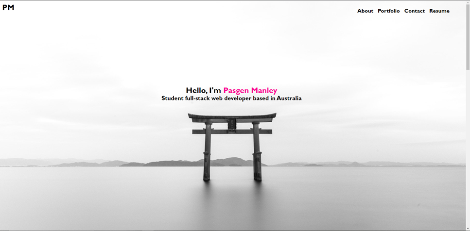

# pasgen-manley-portfolio

## Project Description

This is the first version of my professional web developer portfolio. The webpage was built using HTML and CSS and required three key sections.
those being an about me, portfolio, and contact me section. All of which were completed and like back to the home (navbar/top) page.
The portfolio or project items are all currently placeholder images linking off to various other work that matches with their image. They will be replaced as I complete new work in the future. The contact me section contains a textarea to contact me. Currently, that is just for show as we have not learnt enough javascript at this point to make it functional. This will change in the future. The footer contains links to various social media of mine as another way of contact.

### Link to Website

https://pasgen-manley.github.io/pasgen-manley-portfolio/

#### How it Looks
.

